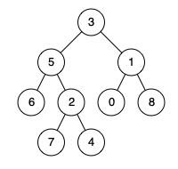

# 236. Lowest Common Ancestor of a Binary Tree

- **Platform:** LeetCode
- **Difficulty:** Medium
- **Topic:** Trees, DFS, Recursion

## Problem

Given a binary tree, find the lowest common ancestor (LCA) of two given nodes.

## Example

Input:

root = [3,5,1,6,2,0,8,null,null,7,4]

p = 5

q = 1

Output:

3

## Approach

1. If the current node is `null`, return `null`.
2. If the current node is either `p` or `q`, return it.
3. Recursively search the left and right subtrees.
4. If both recursive calls return non-null, the current node is the LCA.
5. Otherwise, return the non-null child.

## Complexity

- Time: **O(n)**
- Space: **O(h)**

where `h` is the height of the tree.