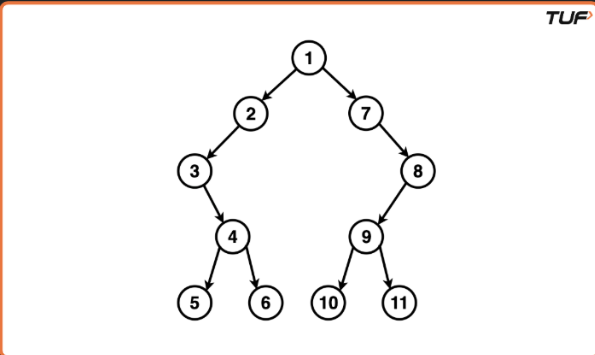
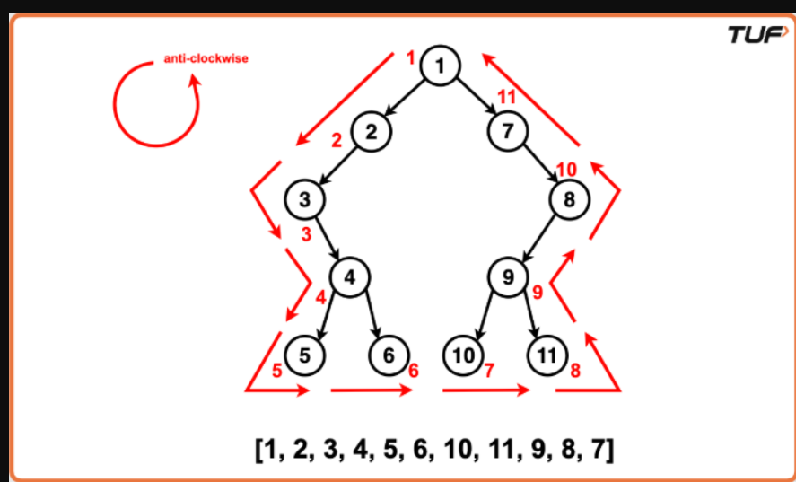

# Boundary Traversal of Binary Tree

## Problem Statement

Given a binary tree, return its **boundary traversal** in an **anti-clockwise** direction.

The boundary traversal consists of:

1. Root node
2. Left boundary (excluding leaf nodes)
3. All leaf nodes (from left to right)
4. Right boundary (excluding leaf nodes, in reverse order)

---

## Example

### Input

```text
Binary Tree:
1 2 7 3 -1 -1 8 -1 4 9 -1 5 6 10 11
```

### Tree



### Output

```text
Boundary Traversal:
[1, 2, 3, 4, 5, 6, 10, 11, 9, 8, 7]
```

### Explanation

The boundary traversal visits the boundary nodes in an anti-clockwise direction.

- **Root:** `1`
- **Left Boundary:** `2 → 3 → 4`
- **Leaf Nodes:** `5 → 6 → 10 → 11`
- **Right Boundary (Bottom to Top):** `9 → 8 → 7`

Final traversal:

```text
[1, 2, 3, 4, 5, 6, 10, 11, 9, 8, 7]
```

---

## Dry Run



---

# Algorithm

### Step 1: Initialize Result

Create an empty vector (or list) `result` to store the boundary traversal.

---

### Step 2: Check Leaf Node

Create a helper function `isLeaf(node)`.

- Return `true` if both left and right children are `NULL`.
- Otherwise return `false`.

This helps avoid duplicate insertion of leaf nodes while traversing left and right boundaries.

---

### Step 3: Add Root

- If the root is **not a leaf**, add it to the result.

---

### Step 4: Traverse Left Boundary

Create a helper function `addLeftBoundary(root)`.

Algorithm:

1. Start from `root->left`.
2. While the current node exists:
   - If it is **not a leaf**, add it to the result.
   - Move to the left child if available.
   - Otherwise move to the right child.

This collects all left boundary nodes except leaf nodes.

---

### Step 5: Add Leaf Nodes

Create a recursive function `addLeaves(root)`.

Algorithm:

1. If the current node is `NULL`, return.
2. If the current node is a leaf:
   - Add it to the result.
3. Recursively visit:
   - Left subtree
   - Right subtree

This ensures all leaf nodes are added from **left to right**.

---

### Step 6: Traverse Right Boundary

Create a helper function `addRightBoundary(root)`.

Algorithm:

1. Start from `root->right`.
2. Traverse downward:
   - Move to the right child if available.
   - Otherwise move to the left child.
3. Store every **non-leaf** node in a temporary vector.
4. Reverse the temporary vector and append it to the result.

This ensures the right boundary is added from **bottom to top**.

---

### Step 7: Return Result

The final order becomes:

```text
Root
→ Left Boundary
→ Leaf Nodes
→ Right Boundary (Reversed)
```

---

# Time Complexity

| Operation | Complexity |
|-----------|------------|
| Left Boundary | O(H) |
| Leaf Traversal | O(N) |
| Right Boundary | O(H) |

Overall:

```text
Time Complexity: O(N)
```

where **N** is the number of nodes in the binary tree.

---

# Space Complexity

- Recursive stack for leaf traversal: **O(H)**
- Temporary vector for right boundary: **O(H)**

Overall:

```text
Space Complexity: O(H)
```

where **H** is the height of the tree.

---

# Key Points

- Root is visited only once.
- Left boundary excludes leaf nodes.
- Leaf nodes are traversed from left to right.
- Right boundary excludes leaf nodes and is added in reverse order.
- Every boundary node appears exactly once in the final traversal.